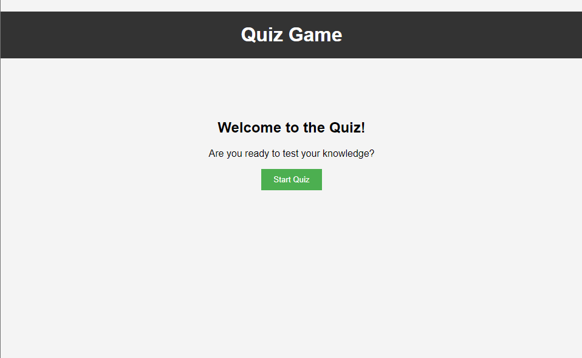

# Coding Quiz Game

Welcome to the Coding Quiz Game! This is a simple quiz application where you can test your coding knowledge with multiple-choice questions.

## Features

- Multiple-choice questions with a timer
- Score calculation based on the number of correct answers and remaining time
- Highscores tracking and display
- Ability to save highscores with initials
- Start screen with a button to begin the quiz
- Highscores page to view the top 10 scores

## Technologies Used

- HTML
- CSS
- JavaScript

## Usage

1. Read the question and choose an answer by clicking on the provided options.
2. If your answer is correct, you will earn points. If it's wrong, points will be deducted, and time will be reduced.
3. Complete the quiz before the timer runs out.
4. At the end of the quiz, enter your initials (maximum of 3 characters) to save your score.
5. You can either return to the start screen or click on the "View Highscores" button to see the top 10 highscores.

[Link to GitHub Here!!!](https://github.com/brendan-aper/week4-Quiz-Game)

[Link to Live Site Here!!!](https://github.com/brendan-aper/week4-Quiz-Game)

## Folder Structure

- `index.html`: The main HTML file that contains the quiz and start screen.
- `assets/html/highscore.html`: The HTML file that displays the highscores.
- `assets/css/style.css`: CSS file for styling the application.
- `assets/js/script.js`: JavaScript file for the quiz functionality.
- `assets/js/highscores.js`: JavaScript file for highscores handling.

## License

N/A

